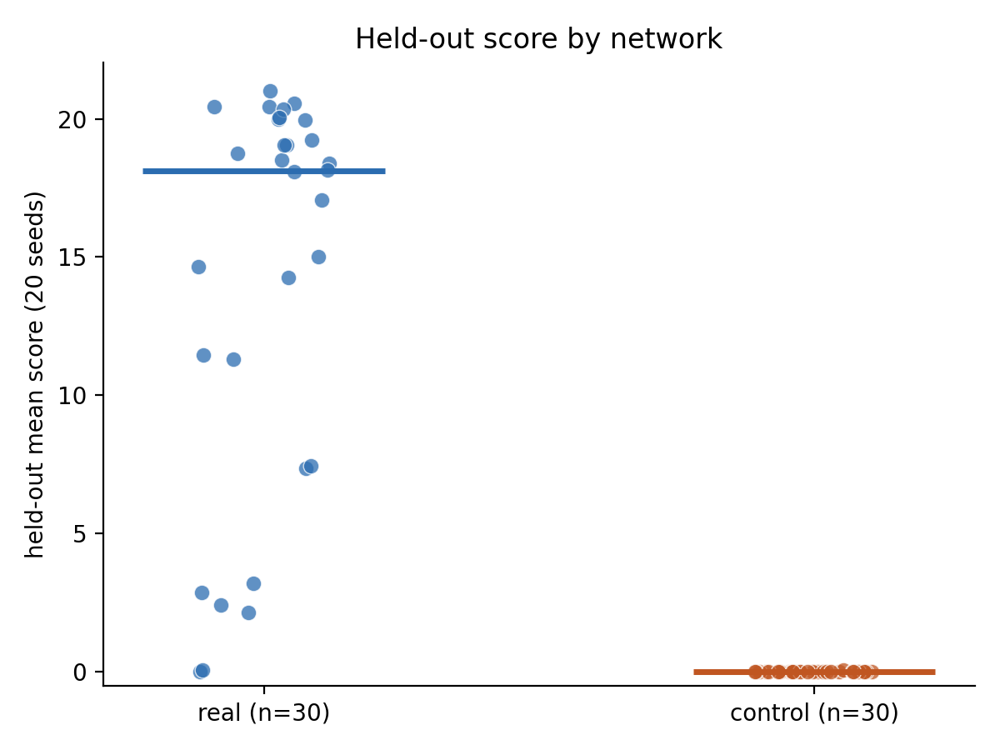
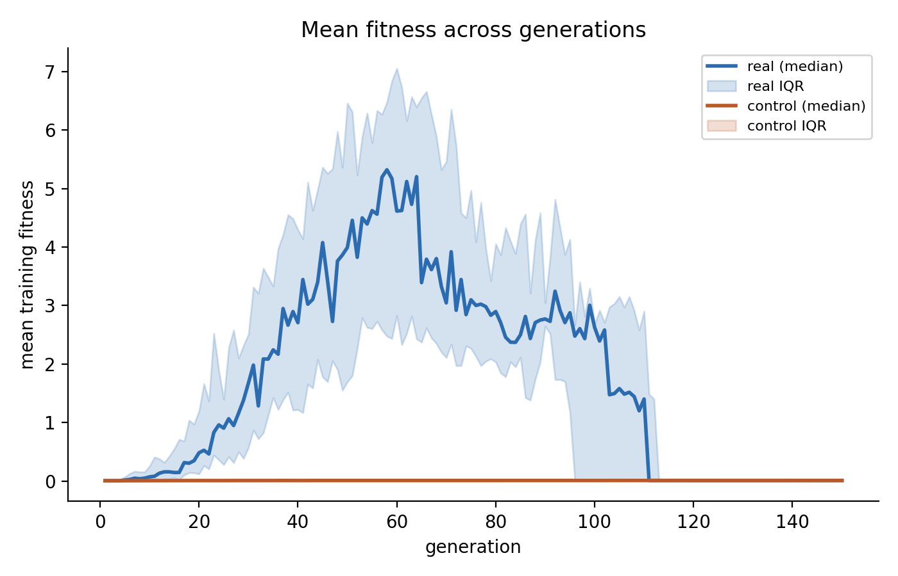
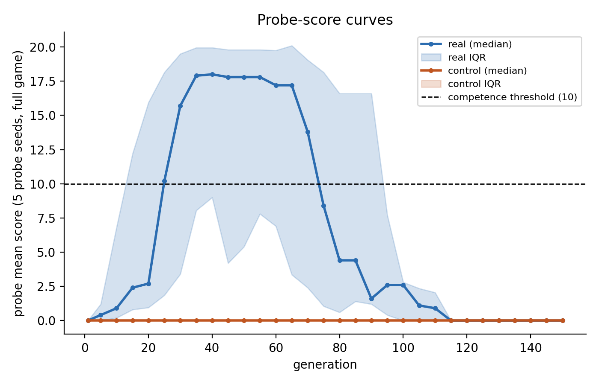
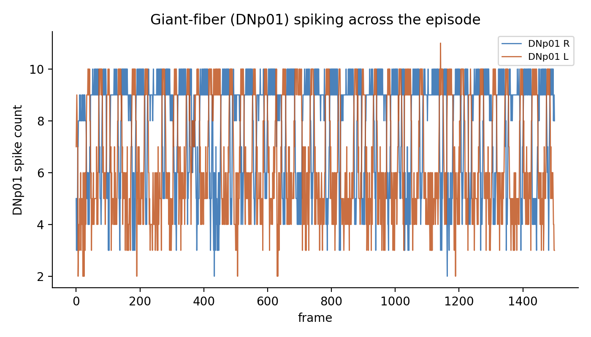

# Results

*Generated entirely by `python -m flybrain.analyse` -- every number below is
computed by the script, none is typed by hand.*

## What was tested

- **C1 (demo):** does the fly's own looming-to-escape circuit, unmodified, play Flappy Bird above chance?
- **C2 (experiment):** does the *real* wiring of that circuit play better than a degree-preserving shuffled control network of identical size, degree sequence and neurotransmitter composition?

## How

30/30 real-connectome runs and 30/30 shuffled-control runs (PLAN L5: 30 independent training seeds per arm) were fitted by CMA-ES over the 16-parameter game-to-neuron interface (PLAN Step 5), then each run's best parameter vector was scored on 20 held-out seeds never used during training. This report compares those held-out scores between arms.

## Pre-registered measures

Fixed 2026-09-22, before any control network was trained (PLAN section 1); neither measure nor its threshold changed after seeing results.

- **Primary:** held-out mean score per run (mean over 20 held-out seeds), 30 real vs 30 control.
- **Secondary:** generations to competence -- first generation whose probe_mean >= 10, censored (as "not reached") when a run never reaches it.

## Results

Runs: found 30/30 real runs, 30/30 control runs finished.

### C1 -- does the real circuit play above chance?

28/30 real-connectome runs score above the best shuffled control (0.05) on unseen levels; the best run's held-out mean is 21.00 of a possible 22. 6/30 runs scored 3.3 or less. An interface that does not use the brain scores 0: with the readout weights zeroed, or with the visual input switched off, the bird never passes a pipe (tests/test_interface.py::TestBrainFreeBaselines). **C1 supported.**

**What the brain is and is not doing.** The interface itself works out whether the bird is above or below the gap and delivers that as *which side's* looming neurons are driven. A brain-free one-line rule acting on that same information (flap when the bird is more than 20 px below the gap, with the same one-frame delay) scores a held-out mean of 20.45 -- higher than 28/30 real runs. So the circuit is not solving the game; its contribution is carrying the left/right signal from the looming neurons to the escape neurons without mixing the two sides.

### Primary -- held-out mean score

| | real | control |
|---|---|---|
| n | 30 | 30 |
| median | 18.125 | 0.000 |
| IQR | [8.412, 19.775] | [0.000, 0.000] |
| mean | 14.040 | 0.002 |
| at ceiling (22) | 0/30 | 0/30 |

Difference in medians (real - control): 18.125.

Mann-Whitney U = 884.000, two-sided p < 0.0001 (method: asymptotic (ties present)). Rank-biserial correlation = 0.964 (real ranks higher than control).

Real outperforms control on held-out score (C2 supported). This is conditional on the interface: it encodes above/below the gap as a left/right input split, so the task needs a network that keeps the two sides apart -- see [EXPLORATORY.md](EXPLORATORY.md) for the evidence that the real wiring does and the shuffled wiring does not. A degree-preserving shuffle is one possible null; others (for example a shuffle that keeps each side's wiring separate) were not tested, so C2 shows only that this shuffle breaks the left/right separation this interface relies on.

### Secondary -- generations to competence (censored)

| | real | control |
|---|---|---|
| n | 30 | 30 |
| median generations (Kaplan-Meier) | 30.000 | not reached |
| censored (never reached) | 8/30 | 30/30 |

Log-rank chi-square = 35.701, p < 0.0001.

Training budget reached: real runs ran 40-150 generations, controls 150-150. Both arms had the same budget (150 generations or 90 minutes, whichever came first), but a candidate that survives makes each generation slower, so runs that learned hit the time limit sooner. This gives the controls more generations, not fewer, so it works against the real wiring rather than for it.

An exploratory (post-hoc, not pre-registered) analysis of *why* the shuffled networks fail is in [EXPLORATORY.md](EXPLORATORY.md).

### Figures

1. 
2. 
3. 
4. 

   Figure 4 was planned to show whether the giant fiber habituates under repeated looming. It cannot: the model has no adaptation mechanism (see Limitations), so the steady firing here says nothing about habituation in the real fly.

## Limitations

- This is a sub-circuit of 2,493 neurons on the path from the looming-detector inputs to the takeoff descending-neuron outputs -- not the whole *Drosophila* brain.
- Edge signs come from predicted, not measured, neurotransmitters (Eckstein et al. 2024 confidence-scored predictions).
- No neuromodulation: dopamine, serotonin and octopamine edges are excluded from the fast simulation entirely (see docs/DATA.md for the excluded-edge count), so no reward or arousal signalling is modelled.
- No learning happens inside the connectome -- weights, signs and wiring are frozen (PLAN L1). Only the 16-parameter game<->neuron interface (Step 5) was fitted.
- Synapse counts are used as a proxy for connection strength, not a measured physiological weight.
- The dt=0.2 ms simulation step (vs. the paper's 0.1 ms) carries a measured timing bias: <= 1.8% for 8 of 10 output neurons, and +11.9% for DNp06 L (docs/DATA.md).
- The left/right split of input seeds for above-gap/below-gap drive is an interface convention with no biological meaning -- left/right is really visual-field side.
- The interface (Step 5) was fitted specifically for this task; it is not a general-purpose readout of the connectome.
- The neuron model has no adaptation or short-term synaptic plasticity, so no neuron -- the giant fiber included -- can habituate. The giant fiber's sustained firing in figure 4 is a property of the model, not a prediction about the real fly, whose giant fiber fires single spikes to trigger an escape.

